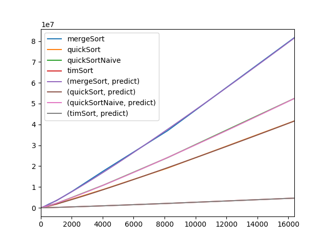

Comparison of sorting algorithms

These are the sorting algorithms contained in sorting.py
* bubbleSort
* insertionSort
* mergeSort
* quickSort
* quickSortNaive (always uses first element as pivot)
* timSort (python's .sort())
* facSort (checks permutations of list until it is sorted)

The drivercode in sorting.py tests each of the algorithms to make sure they sort correctly and prints off an example.

Requires the following:
* tqdm
* scipy
* pandas
* numpy
* matplotlib
* standard library

performance.py arg1 arg2
* runs with two arguments:
	* arg1 is which algorithms you want to time
		* all				times all algorithms
		* simple			bubbleSort and insertionSort
		* divide			mergeSort, quickSort, quickSortNaive, timSort
		* quickunsorted		compares quickSort and quickSortNaive with unsorted lists
		* quicksorted		compares quickSort and quickSortNaive with sorted lists
		* _					use a single algorithm's name to only time it
	* arg2 is which power of 2 items the max list size will be, exclusive
		* arg2 == 5 would make 2^(5-1) == 16 items
	* example
		* python performace.py quickSort 10
		* this will run quickSort on lists up to size 512

performance.py functionality
* times the functions and takes average for each power of 2 up to 2^(arg2-1)
* prints out a table of the times
* fits a curve to each of the functions
* plots the values with the curve fit to it

Example

stopwatch.py
* the stopwatch script is used for timing the functions
* It measures times in nanoseconds

Project Status: Complete - no future work planned.